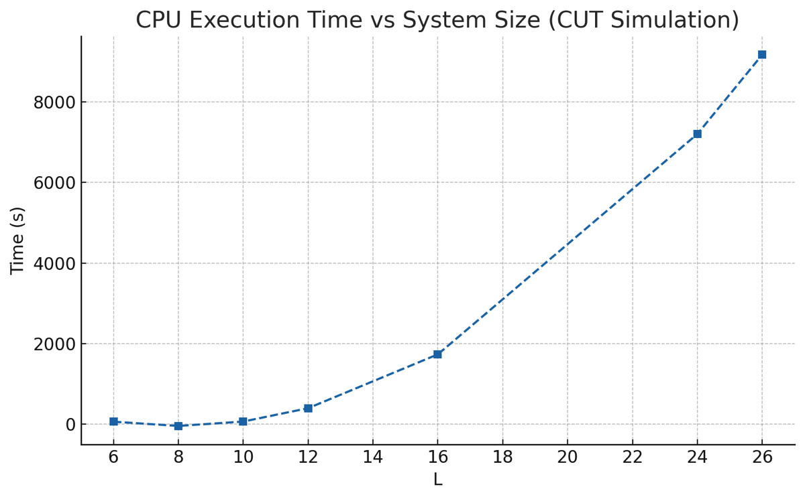

<!-- _class: lead, align-center -->

# 中期答辩

<p align="center">周予恺  <br>2025年6月3日</p>

---

## 量子动力学研究背景


量子系统的演化由**时依薛定谔方程**控制：

$$
i\hbar \frac{d}{dt} \lvert \psi(t) \rangle = H \lvert \psi(t) \rangle
$$

从数值角度看，模拟量子系统的核心任务是：

- **将哈密顿量 $H$ 多次作用在波函数 $\lvert \psi \rangle$ 上，以获得时间演化状态。**

假设每个粒子是自旋-$\frac{1}{2}$（$d=2$），粒子数为 $L$，那么：

- $\lvert \psi(t) \rangle \in \mathbb{C}^{2^L}$
- $H \in \mathbb{C}^{2^L \times 2^L}$

---

## 流方程方法（CUT）

- **核心思想**：通过连续酉变换对角化哈密顿量  
  $$ dU(l) = \exp(-\eta(l)\,dl) = 1 - \eta(l)\,dl $$  
  $$ H(l) = U^\dagger(l)\, H\, U(l), \quad \frac{dH}{dl} = [\eta(l), H(l)] $$

- **流时间 $l$**：一种“算法时间”，从 $l = 0$（初始）演化至 $l \to \infty$（对角化）
- **生成元 $\eta(l)$**：控制了每一步变换的方向，有不同的生成算法

---

## 二维系统的一维展开
  通过一维化，CUT 可以处理高维的系统

- **展开方法**：
  - 将 $d$ 维晶格编号为 $1, 2, \dots, L$，展开为线性排列
  - 原始的局域耦合转化为一维系统中的“长程跃迁”

- **形式变化**：
  - 原系统：局域哈密顿量，耦合仅限近邻格点
  - 展开后：一维哈密顿量 + 长程跃迁项

- **对 CUT 的影响**：
  - CUT 操作基于对易子与代数结构，**与几何结构无关**
  - 长程项不会影响计算流程
  - 适用于任意维度，适合处理高维无序系统与复杂拓扑结构

---

## 一维化示例


---

## CUT 方法的潜在问题

- CUT（流方程）方法通过连续酉变换对角化哈密顿量：
  $$ \frac{dH(l)}{dl} = [\eta(l), H(l)] $$

- 通常选择的生成元为：
  $$ \eta(l) = [H_0(l), V(l)] $$
  - $H_0(l)$：哈密顿量的对角部分
  - $V(l)$：哈密顿量的非对角部分

- **不稳定固定点问题**：
  - 如果系统初始状态中存在大量**近简并能级**或缺乏明显的**能量尺度分离**，则流动可能**收敛极慢**甚至**停滞不前**

---

## 问题本质

- 在 Wegner 生成元下，$V(l)$ 的平方范数满足：
  $$ \frac{d}{dl} \|V(l)\|^2 = -2 \|\eta(l)\|^2 \leq 0 $$

- 然而若系统中存在多个 $i \ne j$ 使得：
  $$ |H_{ii}^{(2)}(0) - H_{jj}^{(2)}(0)| \ll 1 $$
  即出现**近简并对角元素**

- 则生成元分量近似为：
  $$ \eta_{ij}(l) \propto (H_{ii}^{(2)} - H_{jj}^{(2)})\, V_{ij}(l) $$

- 导致：
  - $\eta_{ij}(l) \to 0$，即对角化过程难以继续

---

## 扰乱变换的引入

- **解决方案：引入扰乱变换（Scrambling Transform）**
  - 构造形式为酉变换 $S(l)$，不改变物理性质
  - 目的是“打破简并”，提升 CUT 的收敛性

- **扰乱变换的数学形式**：
  引入一个额外的酉变换 $S(l)$，先将系统“扰乱”：

$$
H'(l) = S(l) H(l) S^\dagger(l)
$$

- **机制说明**：
  - 当能级差 $|H_{ii}^{(2)} - H_{jj}^{(2)}|$ 较小，扰乱变换将主动干预
  - 将哈密顿量转换到更有利于对角化的“预处理基底”

---

## 扰动变换示例


---

## 哈密顿量计算的 GPU 加速


### 哈密顿量分解
```python
# 非相互作用部分
H0 = torch.diag(torch.diag(H))  # 对角
V0 = H - H0                     # 非对角
```

### 实现

- $H(l)$ 拆分为对角/非对角项
- 使用 JIT 编译优化实现高效的张量收缩计算

---


## 量子动力学计算的其他 GPU 优化

### 动态演化优化
```python
def flow_dyn_int(n, J, H0, V0, Hint, num, dl_list):
    ...
    for t in range(len(tlist)):
        num_t[t] = contract(eta0, num, 
                          method='jit')
```

### 本征值计算优化
```python
def flow_levels(n, array, intr):
    ...
    H = array[0].to(device)
    return torch.linalg.eigvalsh(H)
```

---

## 量子动力学计算的其他 GPU 优化

### 张量网络优化
```python
@torch.jit.script
def con_vec42_comp(A, B):
    ...
    # 并行计算张量收缩
    C = torch.einsum('ijkl,lm->ijkm', A, B)
    return C
```

### 内存管理优化
```python
def optimize_memory():
    torch.cuda.empty_cache()
    tensor = torch.zeros(size, 
                        pin_memory=True)
    with torch.cuda.stream(stream):
        tensor = tensor.to(device)
```
---

## 缺乏结构压缩导致资源浪费

主流的 CUT 方法虽然在逻辑上采用了稀疏矩阵的方式，但在实际存储的时候，依然是全量存储。
- 实际测试中，在一维系统的不同状态中，哈密顿量中的非零项不会超过矩阵规模的10%；在二维系统中会更加稠密，但依然有大量压缩空间。

---

## 测试结果



---

## 已尝试的矩阵压缩策略
### Tensor Train (TT) 分解
- 将 $H(l)$ 表示为若干低秩张量链的乘积结构，极大降低存储复杂度。
- 适合 GPU 上的并行 contraction 操作，压缩效率较好。
- TT 分解本质上是近似压缩，存在截断误差，实际测试中，误差在 5% 以内，需要考虑保留更高阶矩阵。

### 低秩分解（Low-Rank Decomposition）

- 初期压缩效果良好，但在 CUT 的更新流动中往往难以维持固定秩，从而导致秩爆炸或误差传播。
- 在短期演化测试中表现良好，误差和 TT 近似，但计算更快

---

## 哈密顿量表示为 pauli 字符串（GPU 实现）
CUT 的主方程：
$$
\frac{dH(l)}{dl} = [\eta(l), H(l)]
$$
张量结构说明

- $H(l)$ 表示为一组 Pauli 张量项之和：
  $$
  H(l) = \sum_\alpha c_\alpha(l)\, P_\alpha
  $$
- 每个 $P_\alpha$ 为 $L$ 位长的 Pauli 字符串，如 $\sigma^z_1 \sigma^x_3$

---

## CUT 方法的数值瓶颈

###  背景：

- CUT 将哈密顿量与算符变换到对角形式：
  - $H(l) \to H_{\text{diag}}$，$O(l)$ 为演化算符
- 物理量仍需在原始基底上计算：
  - $O(t) = U^\dagger(l)\, O(l)\, U(l)$

### 主要困难：

- 酉变换 $U(l)$ 是 $2^L \times 2^L$ 维矩阵
- 实际计算需执行：
  $$
  \langle \psi \lvert U^\dagger(l)\, O(l)\, U(l) \rvert \psi \rangle
  $$
- 在大系统下**内存与计算成本急剧上升**

---

## 在对角基中直接计算观测量

- 在 CUT 过程中，$O(l)$ 与 $H(l)$ 一同被变换到对角基；
- 对角基中的本征态是**张量积态**，形式简单；
- 物理量可直接通过**随机采样本征态**计算：
 ```python
 def nstate(n, a):
    if a == 'random':
        state0 = np.random.choice([0., 1.0], n) 
    elif a == 'random_half':
        state0 = np.array([1. for i in range(n//2)] + 
                         [0.0 for i in range(n//2)])
        np.random.shuffle(state0) 
  ```

---

## 改进结果

- 利用对角基下的结构简洁性：本征态 $\lvert E_n \rangle$ 为 product states，直接在对角基中评估


---

## 数据传输瓶颈

### 出现位置

| 场景 | 描述 | 问题 |
|------|------|------|
| 系数剪枝 | GPU 计算后结果回传 CPU 判断 | 中断 GPU 处理流程 |
| 张量项更新 | 新项生成后回传 CPU 合并 | GPU 无结构去重能力 |
| 流动观测输出 | 每步需输出 $H(l)$ 或 $O(l)$ | 频繁拷贝数据慢 |
| 调试与可视化 | 状态输出回传 host | 测试流程耗时长 |


---

## 对称性未显式利用

### 系统对称性

- 多体量子系统中常存在**守恒量**与**空间对称性**，Hamiltonian 可**block-diagonal** 化，简化演化空间

### ED和张量方法已经利用了对称性
- ED（精确对角化：预构建特定对称子空间，仅对角对应 block 
- Tensor Network：张量结构中引入对称路径标签，剪枝非法演化路径 

### CUT 方法目前缺失

- $[\eta, H]$ 展开过程中生成大量**不守恒或冗余项**
- 项数膨胀、GPU 执行分歧严重、剪枝难度大

---

<!-- _class: lead, align-center -->

# 感谢各位老师批评指正
